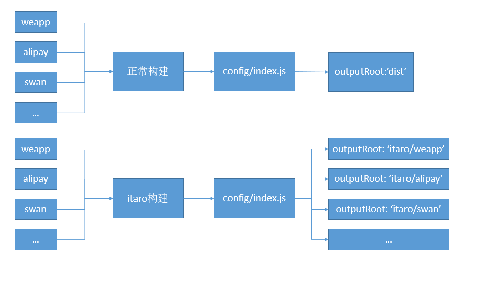

# itaro
[](https://npmjs.org/package/itaro)
[](./LECENSE)

[](https://www.npmjs.com/package/itaro)  
taro 一键打包 cli
对于一个由 @tarojs/cli 创建的 taro 项目，可以零配置一键打包多种小程序代码
也可以在taro 项目的 package.json添加 itaro 属性进行个性化配置。

## 安装（install）
``` bash
npm install -g itaro
```

## 命令(commands)
- itaro build

``` bash
$ itaro build
```
- build in watch mode
``` bash
$ itaro watch
```
- show itaro version
``` bash
$ itaro -v
```
- get help
``` bash
$ itaro -h
```
## 配置(config)
在 taro 项目的 package.json，添加配置项
``` javascript
// package.json
{
  ...
  "itaro": {
    "build": {
      "output": "itaro", // 打包默认的输出根目录
      "excludes": ["rn"], // 不需要打包的小程序名称
      "options": ["alipay", "tt", "qq", "weapp", "rn"] // 需要打包的小程序名称
    }
  }
}
```
`options` 除了可以是 `weapp`, `alipay` 等字符串也可以是
``` javascript
"options": [
  {
    // 构建名称
    "name": "weapp",
    // 构建命令(默认为 npm run build:构建名称)
    "command": "npm run build:weapp", 
     // 输出目录(默认为 输出根目录/构建名称)
    "output": "itaro/weapp",
  }
]
```
## 实现原理
通过修改 `config/index.js outputRoot` 属性来实现


``` javascript
{
  "output": "itaro",
  "options": ["weapp", "alipay", "swan", ...]
}

runTask("weapp")
// 修改 outputRoot: "itaro/weapp",
// 执行构建命令 npm run build:weapp
// 还原 outputRoot: "dist",
runTask("alipay")
// 修改 outputRoot: "itaro/alipay",
// 执行构建命令 npm run build:alipay
// 还原 outputRoot: "dist",
runTask("swan")
// 修改 outputRoot: "itaro/swan",
// 执行构建命令 npm run build:swan
// 还原 outputRoot: "dist",

// ...
```
## CHANGELOG
[CHANGELOG](CHANGELOG.md)
## LECENSE
[MIT](LECENSE)